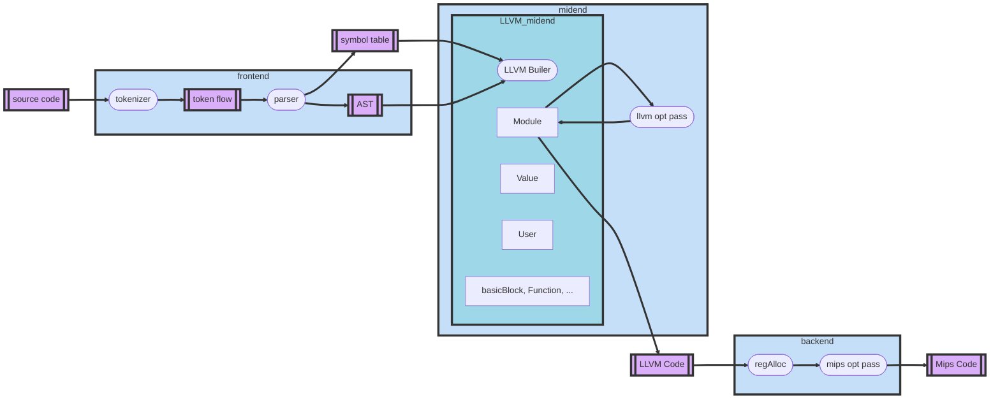

# compilerGraph
### 1.1 功能结构和流程图

可见，本编译系统主要分为前中后端：

- 前端为词法分析和语法分析，能够从源文件生成**抽象语法树**表示，并且进行一定的语义分析和错误处理。
- **中端为LLVM IR**表示，按照llvm编译器的架构，分为Value，Module，User，Use等抽象结构。前端和中端会合作将ast转化为LLVM IR。并且中端将进行一些优化，最主要的包括支配分析，别名分析，Mem2Reg，全局值标号（相当于传播合并+公共子表达式删除），phi结点删除，死代码删除，分支优化，活跃变量分析，冲突图构建等。
- 冲突图构建后，后端将进行寄存器分配。后端输出**Mips汇编码**，管理一个LLVMIR到MIPS的生成模板、mips isa指令、以及mips的寄存器。

